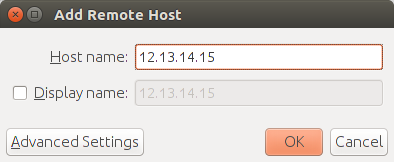
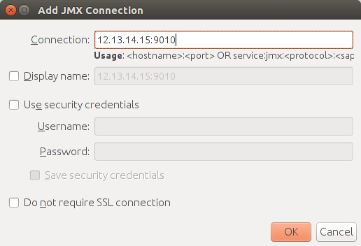
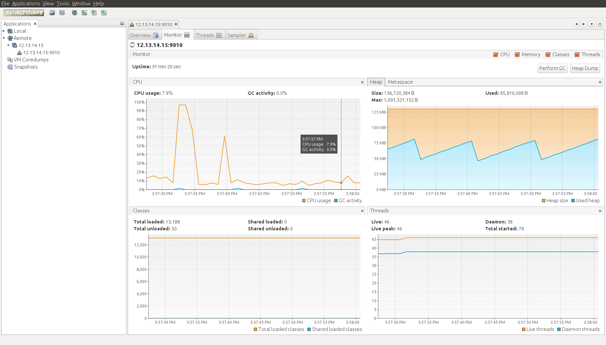
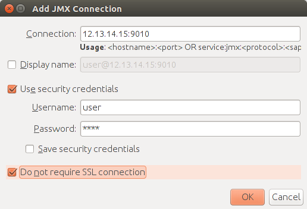
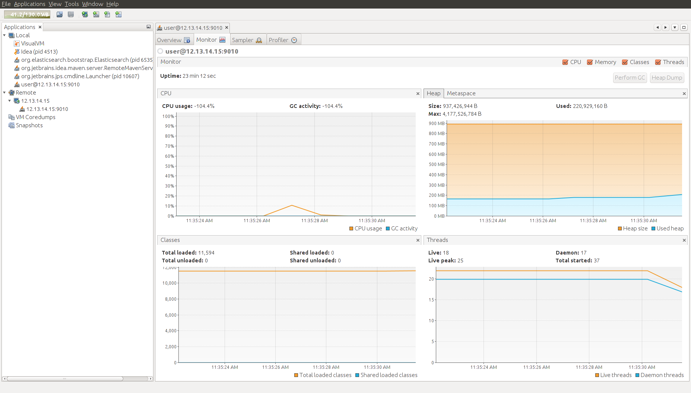

# Connecting VisualVM with a remote application for monitoring via JMX

## Introduction
Monitoring a remote Java application with VisualVM. The article describes process how to setup your application for 
a remote monitoring and connect with VisualVM to the application.

Description was taken from [Oracle web-site](https://docs.oracle.com/javase/tutorial/jmx/overview/).

> The Java Management Extensions (JMX) technology is a standard part of the Java Platform, Standard Edition (Java SE platform). 
> The JMX technology was added to the platform in the Java 2 Platform, Standard Edition (J2SE) 5.0 release.
>
> The JMX technology provides a simple, standard way of managing resources such as applications, devices, and services. 
>Because the JMX technology is dynamic, you can use it to monitor and manage resources as they are created, installed and implemented. 
>You can also use the JMX technology to monitor and manage the Java Virtual Machine (Java VM).
>

## Monitoring an application without authentication
### Settings for the application you want to monitor
There are main parameters for a virtual machine. The parameters should be set to a JVM to bind JMX to IP address 12.13.14.15 and port 9010.
When you create a remote connect in VisualVM you will need to specify IP address and port.
Keep in mind that this configuration is without authentication and with disabled SSL. It means everyone will be able to connect to your application if they know IP address and port.

```text
-Dcom.sun.management.jmxremote
-Dcom.sun.management.jmxremote.port=9010
-Djava.rmi.server.hostname=12.13.14.15
-Dcom.sun.management.jmxremote.authenticate=false
-Dcom.sun.management.jmxremote.ssl=false
```

in command line it will look like that

```text
java -Dcom.sun.management.jmxremote -Dcom.sun.management.jmxremote.port=9010 -Dcom.sun.management.jmxremote.authenticate=false -Dcom.sun.management.jmxremote.ssl=false -Djava.rmi.server.hostname=12.13.14.15 Application app parameters here
```

### Description of the parameters
`-Dcom.sun.management.jmxremote` - enables the JMX remote agent and local monitoring.

`-Dcom.sun.management.jmxremote.port` - enables the JMX remote agent and bind a remote JMX connector to the specified port. There is no default value, the port has to be specified.

`-Djava.rmi.server.hostname` - remote clients will use the specified hostname in the property for connection. A default value is the local host's IP address in "dotted-quad" format.

`-Dcom.sun.management.jmxremote.authenticate` - the property enables/disables authentication for a remote client to monitor the application. The authentication is enabled by default.

`-Dcom.sun.management.jmxremote.ssl` - the property enables/disables SSL authentication. A default value is `false`.

### Connecting to a remote application to monitor
Open VisualVM, add a remote host `File -> Add Remote Host...` and specify host name which was set in parameters above - 12.13.14.15.





The right click on the newly created remote host and choose `Add JMX Connection...`.



The connection should be successful and finally a monitoring tab will be displayed.



## Adding JMX authentication to the monitored application
To enable authentication with JMX for a custom user you need to take few steps.

### First step
Copy a template file `jmxremote.password.template` to your location. It's possible that you have no `jmxremote.password.template`, 
but `jmxremote.password` is available. If first one is not available, then copy the second file. You can find the file in a folder 
`/[JRE_INSTALL_DIR]/lib/management`. I have copied the file to `~/passwords/jmxremote.password`.
Just add a user and a password as a plain text to the end of the file `jmxremote.password` with a whitespace or tab separator 
between them. You don't need to encrypt the password. I added a user with a name `user` and and password `user`
When you are done with editing the file, change access to the file `chmod 600 jmxremote.password`.

### Second step
You need to modify a file `jmxremote.access`. The file is also available in `/[JRE_INSTALL_DIR]/lib/management`. 
In the end of your file `jmxremote.access` add the user name you have added in the file `jmxremote.password` and 
an access level `readonly` or `readwrite`. I have added `user readonly`.

### Third step
Add following parameters to JVM parameters and restart you application.

```text
-Dcom.sun.management.jmxremote.password.file=~/passwords/jmxremote.password
-Dcom.sun.management.jmxremote.authenticate=true
```

Now you are ready to connect to the application with authentication.



If you have set up everything correctly, then after the connection dialog is closed you will see you application in the list of application with label JMX.



## Useful links
- [JMX monitoring and management](http://docs.oracle.com/javase/7/docs/technotes/guides/management/agent.html)
